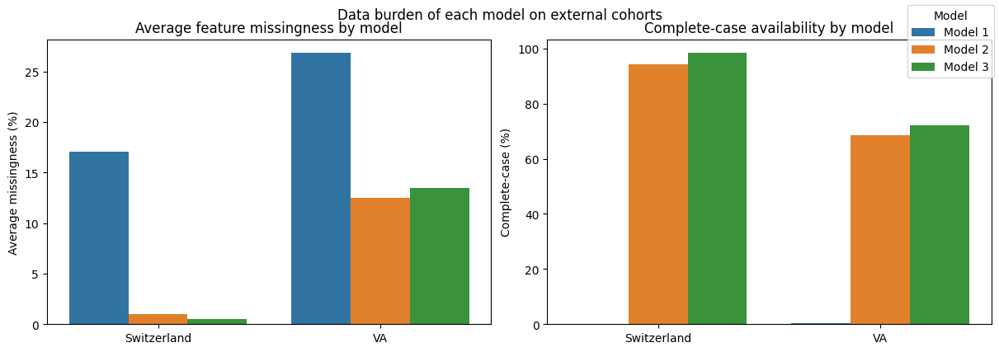

# chd-prediction-dashboard

## Project Overview

This repository contains an end-to-end machine learning system for coronary heart disease screening and risk prediction. The project combines two related but distinct prediction tasks:

1. **10-year CHD risk prediction**
2. **Current heart disease screening**

The modeling work is developed in Jupyter notebooks, exported as reusable machine learning artifacts, and later served through a backend API with a simple frontend interface.

### Datasets

This project uses two public clinical datasets:

- **Framingham Cohort Study** — used for 10-year coronary heart disease risk prediction.  
  Data source: https://biolincc.nhlbi.nih.gov/studies/framcohort/

- **UCI Heart Disease Dataset** — used for current heart disease screening and classification.  
  Data source: https://archive.ics.uci.edu/dataset/45/heart+disease

The datasets are not redistributed in this repository. To reproduce the notebook workflows, download the datasets from the original sources and place them in the expected local data directory.

## Notebook Workflows

### Framingham Notebook — 10-Year CHD Risk Prediction

The `framingham.ipynb` notebook develops the long-term risk prediction component of the project. It uses the Framingham dataset to estimate whether a patient is likely to develop coronary heart disease within the next 10 years.

The target is highly imbalanced: only about **15.2%** of patients develop CHD within 10 years. Because of this, the notebook does not rely on accuracy alone and instead evaluates models using ROC-AUC, PR-AUC, recall, precision, threshold behavior, and calibration.

Exploratory analysis shows that CHD risk is multifactorial. Age and blood-pressure-related variables provide the clearest signal, while cholesterol, glucose, diabetes, smoking intensity, and prevalent hypertension contribute additional but weaker individual associations. No single feature cleanly separates CHD-positive and CHD-negative patients, motivating multivariate modeling.

Before modeling, the notebook builds a leakage-safe preprocessing pipeline. It uses a stratified 90/10 holdout split, missingness indicators for selected variables, median and most-frequent imputation, quantile clipping for skewed continuous variables, and standard scaling. These transformations are implemented with scikit-learn pipelines and a `ColumnTransformer`.

Several model families were evaluated, including Logistic Regression, Random Forest, Gradient Boosting, XGBoost, voting ensembles, and stacking. More complex nonlinear and ensemble models did not provide meaningful gains over a regularized, class-weighted Logistic Regression baseline.

| Model | ROC-AUC mean | ROC-AUC std | PR-AUC mean | PR-AUC std |
|---|---:|---:|---:|---:|
| Logistic Regression | 0.7221 | 0.0270 | 0.3426 | 0.0481 |
| Stacking Ensemble | 0.7215 | 0.0262 | 0.3425 | 0.0460 |
| Random Forest | 0.7079 | 0.0238 | 0.3288 | 0.0419 |

Logistic Regression and the Stacking Ensemble achieved nearly identical cross-validated performance, while Random Forest was weaker. Since the ensemble did not improve performance beyond fold-to-fold variability, Logistic Regression was selected as the final model for its balance of performance, interpretability, simplicity, and deployment stability.

The final model was also evaluated beyond aggregate metrics. Coefficient analysis showed that the strongest positive effects generally aligned with clinically plausible cardiovascular risk factors, including age, male sex, prior stroke, blood-pressure-related variables, diabetes, and smoking intensity. These effects are interpreted as model associations rather than causal relationships.

Risk stratification analysis showed that observed CHD event rates generally increased across higher predicted-risk groups. This suggests that the model is useful for **relative risk ranking**. However, predicted probabilities were systematically higher than observed event rates, so the model is better suited for identifying higher-risk patients than for producing precisely calibrated absolute risk estimates.

For the full analysis, including detailed EDA plots, calibration curves, threshold analysis, and decision curve analysis, see `notebooks/framingham.ipynb`.

### UCI Notebook — Current Heart Disease Screening
### UCI Notebook — Current Heart Disease Screening

The `uci-heart-disease.ipynb` notebook develops the current heart disease screening component of the project. It uses four UCI cohorts — Cleveland, Hungarian, Switzerland, and VA — and converts the original disease-severity target into a binary heart-disease-present label.

The main challenge is that these cohorts are not directly interchangeable. They differ substantially in target distribution, feature availability, missingness, and feature distributions. Cleveland is relatively complete and balanced, while Switzerland and VA are much more disease-positive and have substantial missingness in important clinical variables. In particular, features such as `ca`, `thal`, and `slope` are informative but largely unavailable outside Cleveland.

Because of this, the notebook uses a **tiered modeling strategy** rather than a single fixed model:

| Model | Feature set | Role |
|---|---|---|
| **Model 1 — Full Clinical Model** | 13-feature Cleveland-style clinical feature set | Highest-information model when complete diagnostic inputs are available |
| **Model 2 — Reduced Clinical Model** | Reduced feature set excluding poorly available advanced fields such as `ca`, `thal`, and `slope` | Fallback model when full clinical inputs are unavailable |
| **Model 3 — Minimal Screening Model** | Small common feature set using broadly available variables | Lightweight screening model for limited-input scenarios |

Model 1 achieved the strongest within-Cleveland performance, with ROC-AUC around **0.96** and PR-AUC around **0.94**, confirming that the full clinical feature set contains strong predictive signal. However, its required inputs are often missing in external cohorts, making it unsuitable as a universal model.

Model 2 was developed as a reduced-feature fallback. The notebook compared **Model 2A**, a Cleveland-trained reduced model with external validation, against **Model 2B**, a pooled multi-cohort reduced model evaluated with GroupKFold. Model 2A was selected because the pooled version did not provide a clear generalization advantage. This reduced model also performed better than forcing incomplete records through Model 1 with imputed advanced fields, especially in balanced accuracy, F1 score, and Brier score.

Model 3 was designed as the most portable screening model. It uses a minimal feature set, sacrifices some specificity, and tunes the decision threshold toward sensitivity. Cross-dataset evaluation showed that it preserved useful discrimination under dataset shift, with ROC-AUC around **0.85** between Cleveland and Hungarian and useful but weaker external performance on Switzerland and VA.

The practical result is an adaptive inference strategy: use **Model 1** when complete diagnostic inputs are available, use **Model 2A** when richer clinical fields are partially missing, and use **Model 3** when only minimal screening inputs are available. This improves real-world usability because the simpler models can score many more external records than the full model.

Model interpretation showed clinically plausible behavior across the tiers. The full model relies heavily on diagnostic and stress-test-related variables, while the reduced and minimal models shift toward more accessible signals such as chest pain type, exercise-induced angina, sex, age, resting blood pressure, and maximum heart rate. For Model 3, most predictive signal comes from symptom-related variables, especially chest pain type.

Overall, the UCI notebook demonstrates that the main challenge is not only maximizing performance, but designing a screening system that remains usable when clinical inputs are incomplete. The resulting models should be interpreted as screening and triage-support tools, not as diagnostic systems or calibrated medical probabilities.

For the full analysis, including EDA, model-specific validation, threshold tuning, fallback comparisons, and feature-importance interpretation, see `notebooks/uci-heart-disease.ipynb`.
