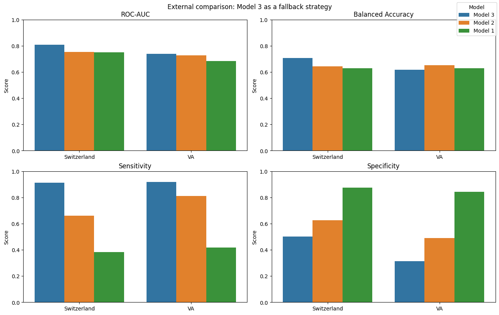
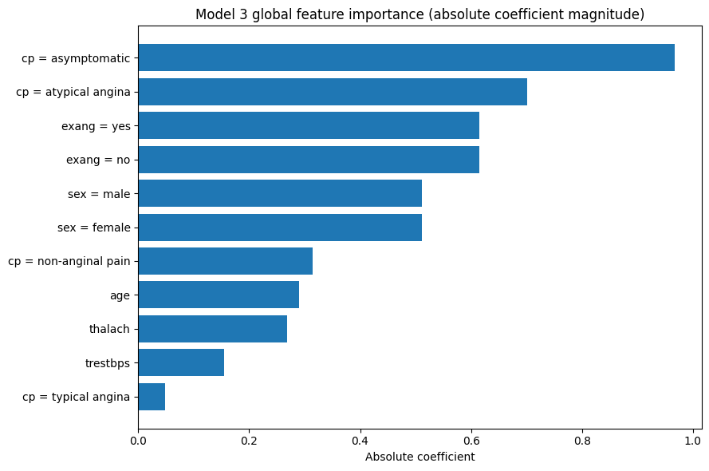

# chd-prediction-dashboard

## Project Overview

This repository contains an end-to-end machine learning system for coronary heart disease screening and risk prediction. The project combines two related but distinct prediction tasks:

1. **10-year CHD risk prediction**
2. **Current heart disease screening**

The modeling work is developed in Jupyter notebooks, exported as reusable machine learning artifacts, and later served through a backend API with a simple frontend interface.

### Datasets

This project uses two public clinical datasets:

- **Framingham Cohort Study** - used for 10-year coronary heart disease risk prediction.  
  Data source: https://biolincc.nhlbi.nih.gov/studies/framcohort/

- **UCI Heart Disease Dataset** - used for current heart disease screening and classification.  
  Data source: https://archive.ics.uci.edu/dataset/45/heart+disease

The datasets are not redistributed in this repository. To reproduce the notebook workflows, download the datasets from the original sources and place them in the expected local data directory.


## How to Run Locally

1. **Download the project files**

   If you have Git installed, clone the repository:

   ```bash
   git clone https://github.com/akimdavidov671/chd-prediction-dashboard.git
   cd chd-prediction-dashboard
   
2. **Place the model artifacts**

   Put artifacts in both `uci_api` and `framingham_api`.

   Expected structure:

   ```text
   framingham_api/
     artifacts/

   uci_api/
     artifacts/
   ```
3. **Install backend dependencies**

   From the project root, run:

   ```bash
   pip install -r requirements.txt
   ```

4. **Start the FastAPI backend**

   From the project root, run:

   ```bash
   python -m uvicorn main:app --reload
   ```

   The backend should be available at:

   ```text
   http://localhost:8000
   ```

   API documentation is available at:

   ```text
   http://localhost:8000/docs
   ```

5. **Install frontend dependencies**

   Open a second terminal and run:

   ```bash
   cd frontend
   npm install
   ```

6. **Start the frontend**

   Still inside the `frontend` folder, run:

   ```bash
   npm run dev
   ```

   The frontend should be available at:

   ```text
   http://localhost:5173
   ```

7. **Use the app**

   Keep both terminals running:

   ```text
   Backend:  http://localhost:8000
   Frontend: http://localhost:5173
   ```

   Then open the frontend URL in your browser.


## Notebook Workflows

### Framingham Notebook - 10-Year CHD Risk Prediction

The `framingham.ipynb` notebook develops the long-term risk prediction component of the project. It uses the Framingham dataset to estimate whether a patient is likely to develop coronary heart disease within the next 10 years.

The target is highly imbalanced: only about **15.2%** of patients develop CHD within 10 years. Because of this, the notebook does not rely on accuracy alone and instead evaluates models using ROC-AUC, PR-AUC, recall, precision, threshold behavior, and calibration.


Exploratory analysis shows that CHD risk is multifactorial. Age and blood-pressure-related variables provide the clearest signal, while cholesterol, glucose, diabetes, smoking intensity, and prevalent hypertension contribute additional but weaker individual associations. No single feature cleanly separates CHD-positive and CHD-negative patients, motivating multivariate modeling.

Before modeling, the notebook builds a leakage-safe preprocessing pipeline. It uses a stratified 90/10 holdout split, missingness indicators for selected variables, median and most-frequent imputation, quantile clipping for skewed continuous variables, and standard scaling. These transformations are implemented with scikit-learn pipelines and a `ColumnTransformer`.

Several model families were evaluated, including Logistic Regression, Random Forest, Gradient Boosting, XGBoost, voting ensembles, and stacking. More complex nonlinear and ensemble models did not provide meaningful gains over a regularized, class-weighted Logistic Regression baseline.

| Model | ROC-AUC mean | ROC-AUC std | PR-AUC mean | PR-AUC std |
|---|---:|---:|---:|---:|
| Logistic Regression | 0.7221 | 0.0270 | 0.3426 | 0.0481 |
| Stacking Ensemble | 0.7215 | 0.0262 | 0.3425 | 0.0460 |
| Random Forest | 0.7079 | 0.0238 | 0.3288 | 0.0419 |


Logistic Regression and the Stacking Ensemble achieved nearly identical cross-validated performance, while Random Forest was weaker. Since the ensemble did not improve performance beyond fold-to-fold variability, Logistic Regression was selected as the final model for its balance of performance, interpretability, simplicity, and deployment stability.

The final model was also evaluated beyond aggregate metrics. Coefficient analysis showed that the strongest positive effects generally aligned with clinically plausible cardiovascular risk factors, including age, male sex, prior stroke, blood-pressure-related variables, diabetes, and smoking intensity. These effects are interpreted as model associations rather than causal relationships.

Risk stratification analysis showed that observed CHD event rates generally increased across higher predicted-risk groups. This suggests that the model is useful for **relative risk ranking**. However, predicted probabilities were systematically higher than observed event rates, so the model is better suited for identifying higher-risk patients than for producing precisely calibrated absolute risk estimates.


For the full analysis, including detailed EDA plots, calibration curves, threshold analysis, and decision curve analysis, see `notebooks/framingham.ipynb`.

### UCI Notebook - Current Heart Disease Screening

The `uci-heart-disease.ipynb` notebook develops the current heart disease screening component of the project. Unlike the Framingham notebook, this task is not long-term risk prediction: it estimates whether heart disease is currently present using the UCI heart disease cohorts.

The main challenge is **heterogeneous data availability**. The four cohorts - Cleveland, Hungarian, Switzerland, and VA - differ in class balance, missingness, and feature distributions. Cleveland is relatively complete, while several clinically useful fields such as `ca`, `thal`, and `slope` are largely unavailable outside it.


Because of this, the notebook builds three models with different practical roles:

| Model | Inputs | Main property | Intended use |
|---|---|---|---|
| **Model 1 — Full Clinical** | 13 clinical features | Highest performance, lowest portability | Use when complete diagnostic inputs are available |
| **Model 2 — Reduced Clinical** | 9 clinical features | Strong fallback with fewer advanced fields | Use when `ca`, `thal`, or `slope` are unavailable |
| **Model 3 — Minimal Screening** | 6 common features | Highest portability, sensitivity-focused | Use when only basic screening inputs are available |

**Model 1** is the strongest model when the full Cleveland-style feature set is available, reaching ROC-AUC around **0.96** and PR-AUC around **0.94** on the Cleveland holdout set. Its weakness is practical coverage: the features that make it strong are often missing in the external cohorts.

**Model 2A** is the selected reduced clinical fallback. It preserves much of the predictive signal while removing poorly available advanced variables. The notebook also tests a pooled multi-cohort reduced model, but it does not provide a clear advantage over Model 2A.

**Model 3** is the most deployable screening model. It uses only broadly available inputs and tunes its threshold toward sensitivity, making it more conservative: it captures more possible disease-positive cases at the cost of additional false positives.


The fallback analysis shows why this tiered design matters. Using the full model with heavily imputed missing fields is not a reliable default strategy. Dedicated reduced and minimal models can score many more patients and often produce better practical decision behavior under missingness.



Model interpretation is also consistent with the intended roles. The full model relies on diagnostic and stress-test variables, while the reduced and minimal models shift toward more accessible signals such as chest pain type, exercise-induced angina, sex, age, resting blood pressure, and maximum heart rate.



Overall, the UCI notebook demonstrates an adaptive screening strategy: use the richest model supported by the available inputs, and fall back to simpler models when data is incomplete. The models are intended for screening and triage support, not diagnosis or calibrated clinical probability estimation.

For the full analysis, including EDA, model validation, threshold tuning, fallback comparisons, and interpretation, see `notebooks/uci-heart-disease.ipynb`.
