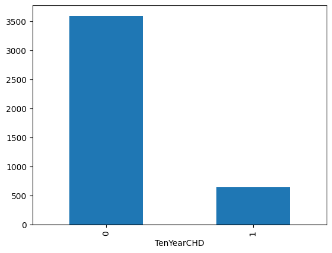
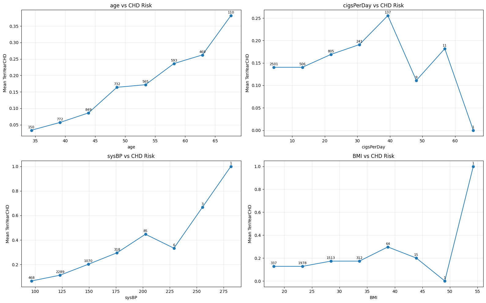
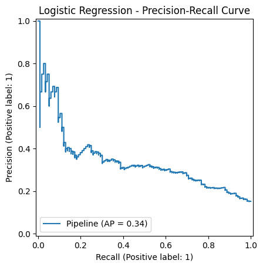
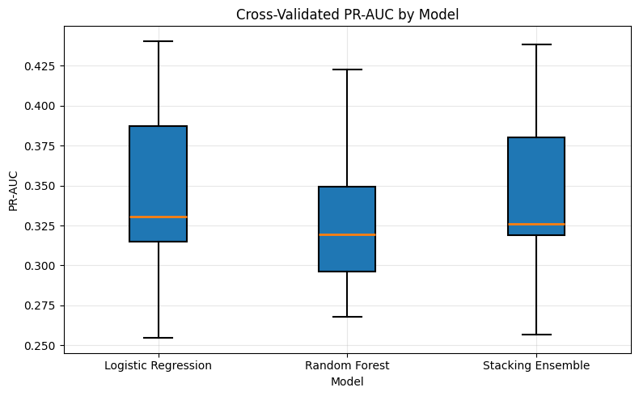
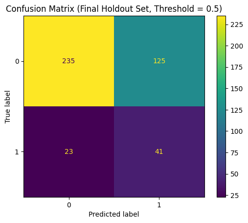
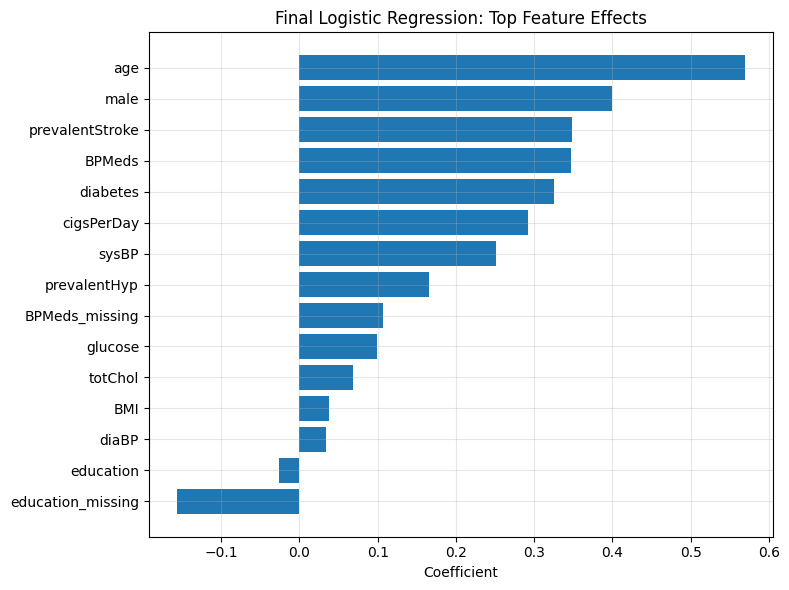
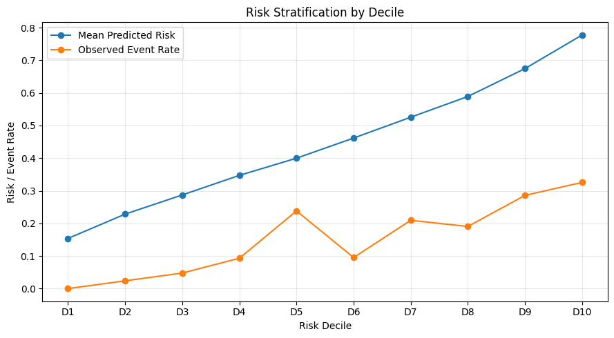
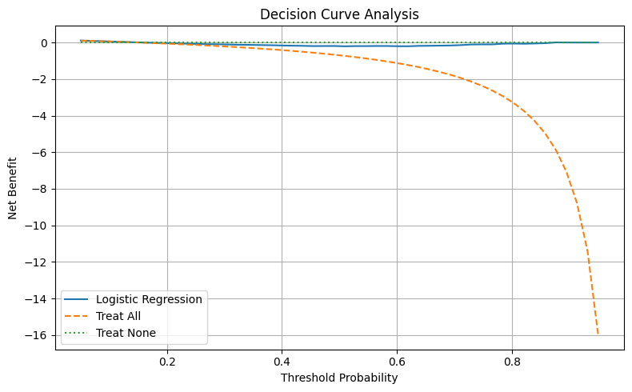

# chd-prediction-dashboard

## Project Overview

This repository contains an end-to-end machine learning system for coronary heart disease screening and risk prediction. The project combines two related but distinct prediction tasks:

1. **10-year CHD risk prediction**
2. **Current heart disease screening**

The modeling work is developed in Jupyter notebooks, exported as reusable machine learning artifacts, and later served through a backend API with a simple frontend interface.

### Datasets

This project uses two public clinical datasets:

- **Framingham Cohort Study** — used for 10-year coronary heart disease risk prediction.  
  Data source: https://biolincc.nhlbi.nih.gov/studies/framcohort/

- **UCI Heart Disease Dataset** — used for current heart disease screening and classification.  
  Data source: https://archive.ics.uci.edu/dataset/45/heart+disease

The datasets are not redistributed in this repository. To reproduce the notebook workflows, download the datasets from the original sources and place them in the expected local data directory.

## Notebook Workflows

### Framingham Notebook — 10-Year CHD Risk Prediction

#### Exploratory Data Analysis

The Framingham dataset presents an imbalanced binary classification problem: only about **15.2%** of patients develop CHD within 10 years, while approximately **84.8%** do not. This makes accuracy alone a weak evaluation metric and motivates the later use of ROC-AUC, PR-AUC, recall, precision, and class-weighted modeling.

The EDA shows that CHD risk is **multifactorial**. Age and blood-pressure-related variables show the clearest risk gradients, while features such as cholesterol, glucose, diabetes, smoking intensity, and prevalent hypertension provide additional but less individually decisive signal. The feature distributions also show substantial overlap between CHD-positive and CHD-negative patients, suggesting that no single variable cleanly separates the two classes.

Key EDA findings:

- The target variable is strongly imbalanced, with a minority positive class.
- CHD risk increases most consistently with **age** and **systolic blood pressure**.
- Several clinically relevant variables show useful but weaker individual associations with the target.
- Missing values, skewed distributions, and high-value outliers motivate the preprocessing pipeline used before modeling.

#### Preprocessing

The preprocessing stage converts the raw Framingham table into a leakage-safe modeling matrix. A stratified 90/10 split is created first, reserving the final holdout set until the end of the notebook while preserving the original CHD-positive class rate.

The preprocessing pipeline then applies:

- missingness indicators for `glucose`, `education`, and `BPMeds`,
- median imputation for continuous variables,
- most-frequent imputation for binary and categorical variables,
- 1st–99th percentile clipping for selected skewed continuous variables (`glucose`, `totChol`, `sysBP`),
- standard scaling for continuous features.

These transformations are implemented with scikit-learn pipelines and a `ColumnTransformer`, so the same preprocessing steps can be reused consistently during model training, validation, and inference.

#### Model Comparison and Selection

The notebook evaluates several model families to test whether more complex models improve prediction beyond a regularized, class-weighted logistic regression baseline.

| Model family | Approx. ROC-AUC | Approx. PR-AUC | Main finding |
|---|---:|---:|---|
| Logistic Regression | ~0.73 | ~0.34 | Strong, interpretable baseline |
| Random Forest | ~0.71 | ~0.33 | Slightly weaker than logistic regression |
| Gradient Boosting | ~0.66 | ~0.25 | Did not improve minority-class performance |
| XGBoost | ~0.65 | ~0.28 | Did not improve minority-class performance |
| Stacking Ensemble | ~0.725 | ~0.342 | Marginal gain, added complexity |

Logistic regression provided the strongest practical baseline. Its ROC-AUC and PR-AUC were competitive, and threshold analysis showed that the model could be tuned toward higher recall when used as a screening-oriented model.

Tree-based and boosting models were tested to capture nonlinearities and feature interactions, but they did not improve discrimination, precision-recall behavior, or calibration. This suggested that the available signal was largely captured by the simpler linear model, while more flexible models mostly added variance or noise.

Ensemble methods, including soft voting, weighted voting, and stacking, were also explored. Stacking produced the strongest ranking metrics in this experimental phase, but the improvement over logistic regression was very small and did not justify the extra complexity for deployment.

After the initial experiments, the strongest candidate models were evaluated using repeated stratified cross-validation. This provided a more robust estimate of model performance and reduced dependence on a single validation split.

| Model | ROC-AUC mean | ROC-AUC std | PR-AUC mean | PR-AUC std |
|---|---:|---:|---:|---:|
| Logistic Regression | 0.7221 | 0.0270 | 0.3426 | 0.0481 |
| Stacking Ensemble | 0.7215 | 0.0262 | 0.3425 | 0.0460 |
| Random Forest | 0.7079 | 0.0238 | 0.3288 | 0.0419 |

Logistic Regression and the Stacking Ensemble achieved nearly identical ROC-AUC and PR-AUC scores, while Random Forest performed slightly worse. The small difference between Logistic Regression and the Stacking Ensemble was much smaller than the observed fold-to-fold variability, suggesting that the ensemble did not provide a meaningful performance advantage.

Because of this, Logistic Regression was selected as the final model. It offered the best balance of predictive performance, simplicity, interpretability, and deployment stability.

#### Model Interpretation and Risk Stratification

After selecting Logistic Regression as the final model, the notebook examines how the model behaves beyond aggregate metrics such as ROC-AUC and PR-AUC. This step is important because the model is intended for screening-oriented risk stratification, not just binary classification.

The model’s strongest positive feature effects generally align with clinically plausible cardiovascular risk factors, including **age**, **male sex**, **prior stroke**, **blood-pressure-related variables**, **diabetes**, and **smoking intensity**. This supports the choice of Logistic Regression as an interpretable model: the learned coefficients provide a readable summary of which variables increase or decrease predicted CHD risk within the fitted pipeline.

At the same time, these effects should be interpreted as model associations rather than causal claims. Coefficient magnitudes are also affected by preprocessing steps such as scaling, imputation, and missingness indicators, so they are most useful for understanding the relative behavior of this specific model.

The notebook also evaluates whether the model separates patients into meaningful risk groups. Risk-decile analysis shows that observed CHD event rates generally increase across higher predicted-risk groups, indicating that the model is useful for **relative risk ranking**. However, the predicted probabilities are systematically higher than the observed event rates, suggesting that the model is better suited for identifying higher-risk patients than for producing precisely calibrated absolute risk estimates.

Finally, decision curve analysis is used to evaluate whether the model’s predictions provide practical value across different decision thresholds. The model shows positive net benefit compared with a “treat none” baseline across a broad range of thresholds, especially in the mid-threshold region. This supports its use as a screening-oriented risk stratification tool within the scope of this project.

