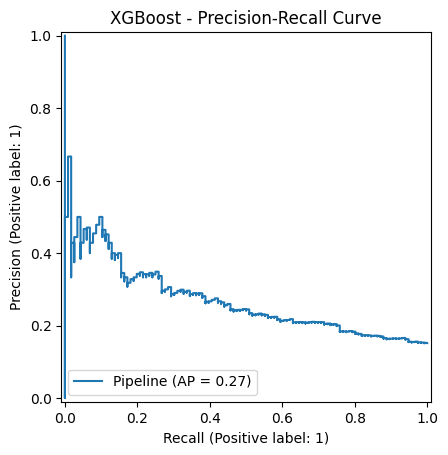

# chd-prediction-dashboard

## Project Overview

This repository contains an end-to-end machine learning system for coronary heart disease screening and risk prediction. The project combines two related but distinct prediction tasks:

1. **10-year CHD risk prediction**
2. **Current heart disease screening**

The modeling work is developed in Jupyter notebooks, exported as reusable machine learning artifacts, and later served through a backend API with a simple frontend interface.

### Datasets

This project uses two public clinical datasets:

- **Framingham Cohort Study** — used for 10-year coronary heart disease risk prediction.  
  Data source: https://biolincc.nhlbi.nih.gov/studies/framcohort/

- **UCI Heart Disease Dataset** — used for current heart disease screening and classification.  
  Data source: https://archive.ics.uci.edu/dataset/45/heart+disease

The datasets are not redistributed in this repository. To reproduce the notebook workflows, download the datasets from the original sources and place them in the expected local data directory.

## Notebook Workflows

### Framingham Notebook — 10-Year CHD Risk Prediction

#### Exploratory Data Analysis

The Framingham dataset presents an imbalanced binary classification problem: only about **15.2%** of patients develop CHD within 10 years, while approximately **84.8%** do not. This makes accuracy alone a weak evaluation metric and motivates the later use of ROC-AUC, PR-AUC, recall, precision, and class-weighted modeling.

The EDA shows that CHD risk is **multifactorial**. Age and blood-pressure-related variables show the clearest risk gradients, while features such as cholesterol, glucose, diabetes, smoking intensity, and prevalent hypertension provide additional but less individually decisive signal. The feature distributions also show substantial overlap between CHD-positive and CHD-negative patients, suggesting that no single variable cleanly separates the two classes.

Key EDA findings:

- The target variable is strongly imbalanced, with a minority positive class.
- CHD risk increases most consistently with **age** and **systolic blood pressure**.
- Several clinically relevant variables show useful but weaker individual associations with the target.
- Missing values, skewed distributions, and high-value outliers motivate the preprocessing pipeline used before modeling.

#### Preprocessing

The preprocessing stage converts the raw Framingham table into a leakage-safe modeling matrix. A stratified 90/10 split is created first, reserving the final holdout set until the end of the notebook while preserving the original CHD-positive class rate.

The preprocessing pipeline then applies:

- missingness indicators for `glucose`, `education`, and `BPMeds`,
- median imputation for continuous variables,
- most-frequent imputation for binary and categorical variables,
- 1st–99th percentile clipping for selected skewed continuous variables (`glucose`, `totChol`, `sysBP`),
- standard scaling for continuous features.

These transformations are implemented with scikit-learn pipelines and a `ColumnTransformer`, so the same preprocessing steps can be reused consistently during model training, validation, and inference.

#### Experimentation

The notebook evaluates several model families to test whether more complex models improve prediction beyond a regularized, class-weighted logistic regression baseline.

| Model family | Approx. ROC-AUC | Approx. PR-AUC | Main finding |
|---|---:|---:|---|
| Logistic Regression | ~0.73 | ~0.34 | Strong, interpretable baseline |
| Random Forest | ~0.71 | ~0.33 | Slightly weaker than logistic regression |
| Gradient Boosting | ~0.66 | ~0.25 | Did not improve minority-class performance |
| XGBoost | ~0.65 | ~0.28 | Did not improve minority-class performance |
| Stacking Ensemble | ~0.725 | ~0.342 | Marginal gain, added complexity |

Logistic regression provided the strongest practical baseline. Its ROC-AUC and PR-AUC were competitive, and threshold analysis showed that the model could be tuned toward higher recall when used as a screening-oriented model.

Tree-based and boosting models were tested to capture nonlinearities and feature interactions, but they did not improve discrimination, precision-recall behavior, or calibration. This suggested that the available signal was largely captured by the simpler linear model, while more flexible models mostly added variance or noise.

Ensemble methods, including soft voting, weighted voting, and stacking, were also explored. Stacking produced the strongest ranking metrics in this experimental phase, but the improvement over logistic regression was very small and did not justify the extra complexity for deployment.

#### Cross-Validation and Model Selection

#### Understanding Model Behaviour
