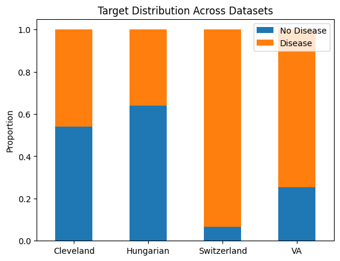
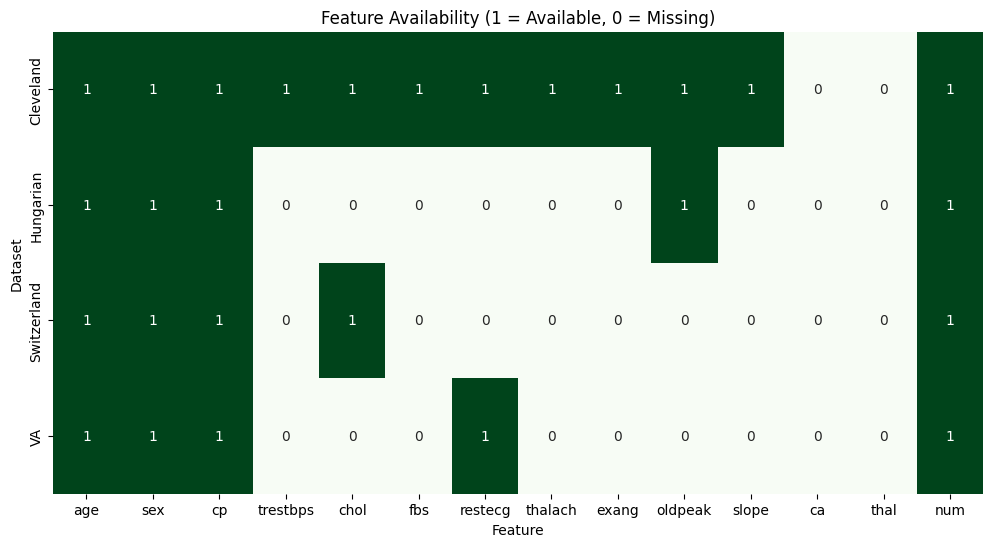
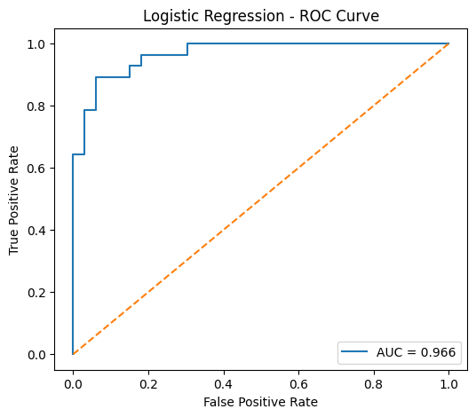
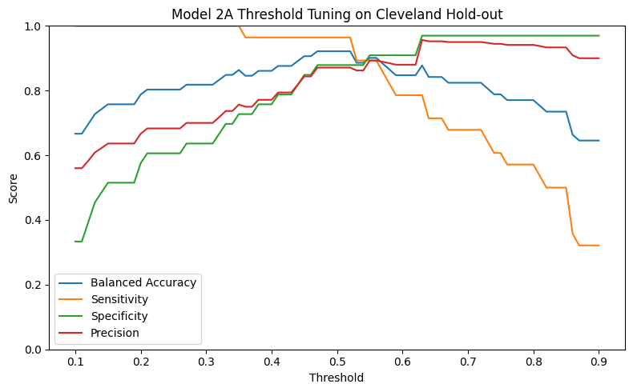
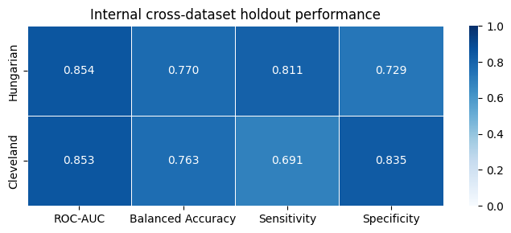
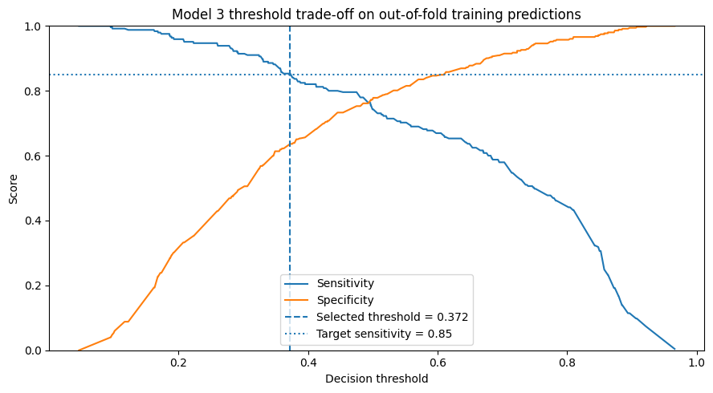

# chd-prediction-dashboard

## Project Overview

This repository contains an end-to-end machine learning system for coronary heart disease screening and risk prediction. The project combines two related but distinct prediction tasks:

1. **10-year CHD risk prediction**
2. **Current heart disease screening**

The modeling work is developed in Jupyter notebooks, exported as reusable machine learning artifacts, and later served through a backend API with a simple frontend interface.

### Datasets

This project uses two public clinical datasets:

- **Framingham Cohort Study** — used for 10-year coronary heart disease risk prediction.  
  Data source: https://biolincc.nhlbi.nih.gov/studies/framcohort/

- **UCI Heart Disease Dataset** — used for current heart disease screening and classification.  
  Data source: https://archive.ics.uci.edu/dataset/45/heart+disease

The datasets are not redistributed in this repository. To reproduce the notebook workflows, download the datasets from the original sources and place them in the expected local data directory.

## Notebook Workflows

### Framingham Notebook — 10-Year CHD Risk Prediction

The `framingham.ipynb` notebook develops the long-term risk prediction component of the project. It uses the Framingham dataset to estimate whether a patient is likely to develop coronary heart disease within the next 10 years.

The target is highly imbalanced: only about **15.2%** of patients develop CHD within 10 years. Because of this, the notebook does not rely on accuracy alone and instead evaluates models using ROC-AUC, PR-AUC, recall, precision, threshold behavior, and calibration.

Exploratory analysis shows that CHD risk is multifactorial. Age and blood-pressure-related variables provide the clearest signal, while cholesterol, glucose, diabetes, smoking intensity, and prevalent hypertension contribute additional but weaker individual associations. No single feature cleanly separates CHD-positive and CHD-negative patients, motivating multivariate modeling.

Before modeling, the notebook builds a leakage-safe preprocessing pipeline. It uses a stratified 90/10 holdout split, missingness indicators for selected variables, median and most-frequent imputation, quantile clipping for skewed continuous variables, and standard scaling. These transformations are implemented with scikit-learn pipelines and a `ColumnTransformer`.

Several model families were evaluated, including Logistic Regression, Random Forest, Gradient Boosting, XGBoost, voting ensembles, and stacking. More complex nonlinear and ensemble models did not provide meaningful gains over a regularized, class-weighted Logistic Regression baseline.

| Model | ROC-AUC mean | ROC-AUC std | PR-AUC mean | PR-AUC std |
|---|---:|---:|---:|---:|
| Logistic Regression | 0.7221 | 0.0270 | 0.3426 | 0.0481 |
| Stacking Ensemble | 0.7215 | 0.0262 | 0.3425 | 0.0460 |
| Random Forest | 0.7079 | 0.0238 | 0.3288 | 0.0419 |

Logistic Regression and the Stacking Ensemble achieved nearly identical cross-validated performance, while Random Forest was weaker. Since the ensemble did not improve performance beyond fold-to-fold variability, Logistic Regression was selected as the final model for its balance of performance, interpretability, simplicity, and deployment stability.

The final model was also evaluated beyond aggregate metrics. Coefficient analysis showed that the strongest positive effects generally aligned with clinically plausible cardiovascular risk factors, including age, male sex, prior stroke, blood-pressure-related variables, diabetes, and smoking intensity. These effects are interpreted as model associations rather than causal relationships.

Risk stratification analysis showed that observed CHD event rates generally increased across higher predicted-risk groups. This suggests that the model is useful for **relative risk ranking**. However, predicted probabilities were systematically higher than observed event rates, so the model is better suited for identifying higher-risk patients than for producing precisely calibrated absolute risk estimates.

For the full analysis, including detailed EDA plots, calibration curves, threshold analysis, and decision curve analysis, see `notebooks/framingham.ipynb`.

### UCI Notebook — Current Heart Disease Screening

#### Dataset Shift and Feature Availability

The UCI heart disease notebook combines four related cohorts: Cleveland, Hungarian, Switzerland, and VA. EDA shows that these cohorts are not directly interchangeable. They differ substantially in size and target distribution: Cleveland is relatively balanced, Hungarian has a lower positive rate, while Switzerland and VA are heavily skewed toward disease-positive cases. This creates a risk that naive dataset merging would learn dataset-specific prevalence patterns rather than stable disease signals.

The more important constraint is feature availability. Cleveland is nearly complete, but several clinically informative variables such as `ca`, `thal`, and `slope` are largely missing outside Cleveland. In contrast, a smaller set of features, including `age`, `sex`, and `cp`, is consistently available across cohorts, while variables such as `trestbps`, `thalach`, `exang`, and `oldpeak` are only partially reliable depending on the dataset.

This creates a trade-off between predictive strength and practical coverage. Some of the strongest predictors are not consistently available across datasets, while the most portable features contain less information. This finding motivates the notebook’s tiered modeling strategy: a full clinical model when complete inputs are available, reduced models when advanced fields are missing, and a minimal screening model for limited-input scenarios.

#### Tiered Modeling Strategy

The EDA showed that the UCI cohorts differ substantially in feature availability, missingness, and target distribution. Because of this, the notebook does not rely on a single model trained on one fixed feature set. Instead, it develops a **tiered modeling strategy** in which each model is designed for a different level of available clinical information.

| Model | Feature set | Role |
|---|---|---|
| **Model 1 — Full Clinical Model** | Full 13-feature Cleveland feature set | Highest-performance model when complete clinical inputs are available |
| **Model 2 — Reduced Clinical Model** | Reduced feature set excluding poorly available advanced fields such as `ca`, `thal`, and `slope` | Fallback model when full clinical inputs are unavailable |
| **Model 3 — Minimal Screening Model** | Small common feature set using basic and more consistently available variables | Lightweight screening model for limited-input scenarios |

This design reflects a practical trade-off between **predictive richness** and **input availability**. The full clinical model can use the most informative feature set, but it is only usable when those fields are present. The reduced and minimal models sacrifice some detail in exchange for broader coverage and better robustness across heterogeneous datasets.

#### Model Development and Selection

The notebook develops and evaluates each tier of the UCI screening strategy separately, because each model is intended for a different data-availability scenario.

**Model 1 — Full Clinical Model** uses the complete 13-feature Cleveland dataset and serves as the highest-information model. A Logistic Regression model performed very strongly on the Cleveland holdout set, with ROC-AUC around **0.96**, PR-AUC around **0.94**, balanced accuracy around **0.90**, and balanced sensitivity/specificity. This confirmed that the full clinical feature set contains strong predictive signal when all required variables are available.

However, Model 1 is limited by feature availability. Several of its strongest fields, especially `ca`, `thal`, and `slope`, are largely missing outside the Cleveland cohort. As a result, strong within-Cleveland performance does not automatically translate into practical usability across the other UCI cohorts.

**Model 2 — Reduced Clinical Model** was developed as a fallback when advanced clinical fields are unavailable. It removes poorly available variables while retaining a clinically meaningful reduced feature set. Threshold tuning selected an operating threshold of approximately **0.47**, producing strong Cleveland holdout performance with balanced accuracy around **0.92**, sensitivity around **0.96**, and specificity around **0.88**.

Model 2 was not a single reduced model: the notebook compared Model 2A, a Cleveland-trained reduced model with external validation, against Model 2B, a pooled multi-cohort reduced model evaluated with GroupKFold. Model 2A was ultimately preferred because Model 2B did not provide a clear generalization advantage.

This model showed that much of the predictive signal can be preserved without the full 13-feature set. At the same time, external evaluation still showed performance degradation under stronger dataset shift, especially on the Switzerland and VA cohorts. This reinforced the need for an even more portable screening model.

**Model 3 — Minimal Screening Model** uses a small feature set designed for broader availability and lightweight screening. Its features are less rich than Model 1 or Model 2, but they are more realistic for limited-input settings. Cross-dataset holdout evaluation between Cleveland and Hungarian showed stable discrimination, with mean ROC-AUC around **0.85** and mean balanced accuracy around **0.77**. External testing remained useful on Switzerland and VA, though performance dropped under stronger cohort shift.

Because Model 3 is intended for screening, threshold tuning prioritized sensitivity over specificity. A threshold of approximately **0.37** was selected from out-of-fold training predictions to target sensitivity of at least **0.85**. This made the model more conservative: it captured more positive cases, but at the cost of additional false positives, especially on the VA cohort.

Overall, the model development process supports the tiered strategy. Model 1 offers the strongest performance when complete clinical data is available, Model 2 provides a strong reduced-feature fallback, and Model 3 provides the most portable screening option when only limited inputs are available.

#### Fallback Strategy and Practical Use

#### Model Behaviour and Limitations
